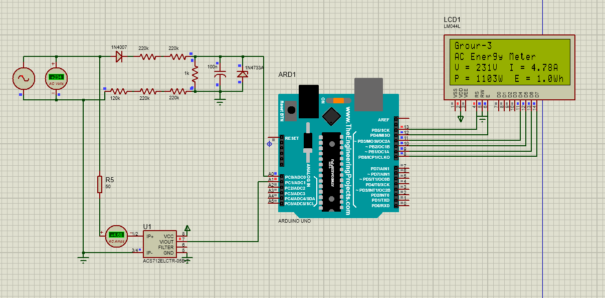
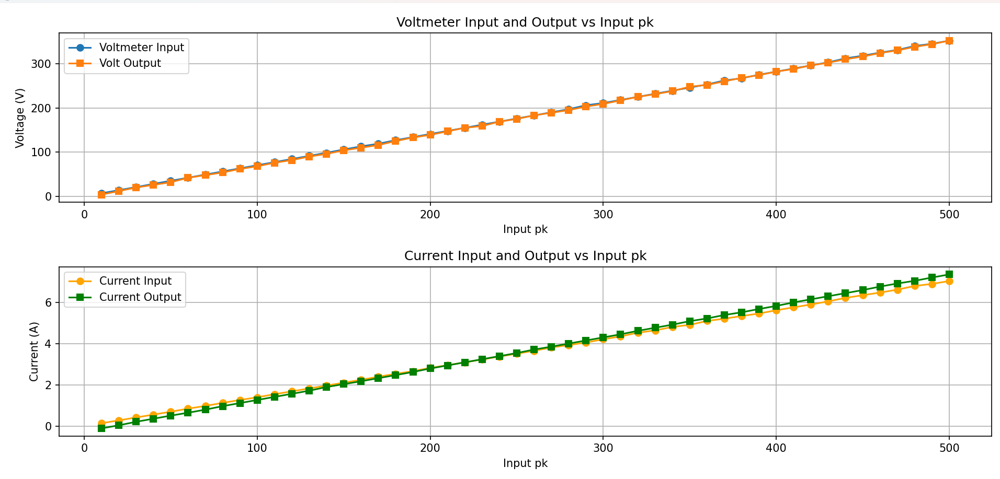

# AC-Energymeter-Arduino

## Project Description
Provide a brief overview of your project, its goals, and what it does.  
Describe key features, technologies used, and any important details you'd like to share about your project.

## Project Details
- **Technology Stack**: preoteus , arduino , hall effect , C , python.
- **Version**: 1.0.0
- **License**: MIT License
- **Author**: [Pretom Das](https://github.com/pretom-das)

## Features
- Feature 1: Measures AC RMS voltage and current .
- Feature 2: calculate the power delivered and its costing.
- Feature 3: cost efficient alternative of typical energy meter.

## Screenshots
Here are some screenshots of the project:


*Screenshot 1 Proteus simulation*


*Screenshot 2 Acurracy curve*

## Installation
1. Clone the repository:  
   ```bash
   git clone https://github.com/pretom-das/AC-Energymeter-Arduino/
